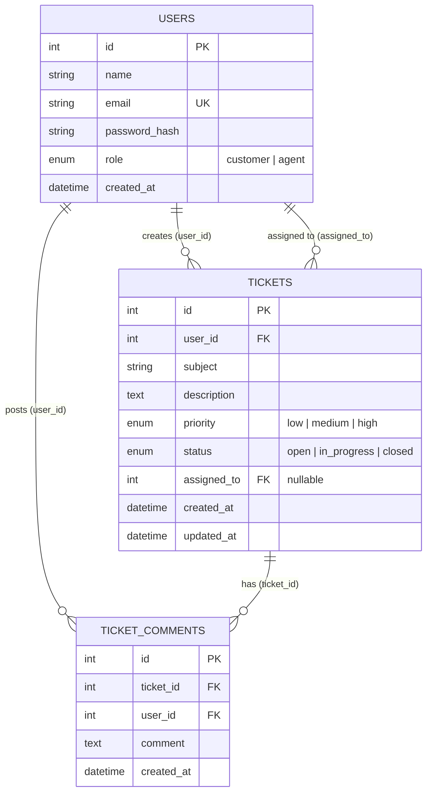

# Support Ticket Management System

A full-stack Support Ticket Management web application built with **React**, **Express/Node.js**, and **MySQL**. Designed with a focus on fundamental full-stack principles, clean architecture, security, and interview explainability.

---

## 🏗️ Architecture Diagram

```text
React Frontend (SPA with Context API & React Router)
          ↓ (Axios Interceptors with JWT Bearer Token)
Express REST API Server (Node.js)
          ↓ (JWT Auth & Role-Based Middleware)
Express Controllers & MySQL Parameterized Queries
          ↓ (mysql2 Connection Pool)
MySQL Database (support_tickets)
```

---

## ✨ Features

### 👤 Customer Role
* **Authentication**: Register customer account & JWT-based login.
* **Create Tickets**: Submit support tickets with title, description, and priority level.
* **Dashboard & Queue**: View own tickets only with status indicators and search/filter.
* **Ticket Details**: View detailed issue info, full discussion history, and add responses.
* **Delete Open Tickets**: Customers can delete their own open tickets before work begins.

### 🛡️ Support Agent Role
* **Agent Dashboard**: Queue of all customer tickets with statistics counters (Open, In Progress, Closed).
* **Advanced Search & Filtering**: Search by keyword, filter by status or priority, and sort by date or priority level.
* **Ticket Lifecycle Management**: Update ticket status (`open`, `in_progress`, `closed`) and priority (`low`, `medium`, `high`).
* **Agent Assignment**: Assign tickets to specific support agents.
* **Official Responses**: Add support responses to customer ticket discussions.

---

## 🛠️ Technology Stack

* **Frontend**: React.js (Vite), React Router v6, Axios, Lucide React (Icons), Vanilla CSS (Custom Design System).
* **Backend**: Node.js, Express.js, JSON Web Tokens (`jsonwebtoken`), `bcrypt`, `cors`, `dotenv`.
* **Database**: MySQL, `mysql2` driver (Connection pool, raw parameterized SQL queries, no ORM).
* **Testing**: Jest, Supertest.
* **API Documentation**: Postman Collection (`postman/support-ticket-system.json`).

---

## 📁 Project Structure

```text
support-ticket-system/
├── frontend/
│   ├── src/
│   │   ├── components/       # Reusable UI (Navbar, Badges, Filters, ProtectedRoute)
│   │   ├── context/          # AuthContext provider & hooks
│   │   ├── pages/            # Login, Register, Dashboards, Ticket Details
│   │   ├── services/         # Axios API client & interceptors
│   │   ├── styles/           # Global modern CSS design system
│   │   ├── App.jsx           # App routing & role guards
│   │   └── main.jsx          # Entry point
│   ├── .env.example
│   └── package.json
├── backend/
│   ├── controllers/          # Request handlers (auth, tickets, comments, users)
│   ├── middleware/           # authMiddleware (JWT & RBAC), validateMiddleware
│   ├── routes/               # Express API routes
│   ├── db.js                 # mysql2 connection pool configuration
│   ├── server.js             # Express app & HTTP listener
│   ├── .env.example
│   └── package.json
├── database/
│   ├── schema.sql            # Table definitions, FK constraints & indexes
│   └── seed.sql              # Sample users, tickets & comments
├── tests/
│   └── api.test.js           # Integration test suite (Supertest & Jest)
├── postman/
│   └── support-ticket-system.json # Complete Postman collection
├── README.md
└── .gitignore
```

---

## 🗄️ Database Schema & Relationships



---

## 🔌 API Endpoints

| Method | Endpoint | Access | Description |
| :--- | :--- | :--- | :--- |
| **POST** | `/api/auth/register` | Public | Register customer account |
| **POST** | `/api/auth/login` | Public | Authenticate user & receive JWT token |
| **GET** | `/api/tickets` | Authenticated | Customer gets own tickets; Agent gets all (supports filter/sort/search) |
| **POST** | `/api/tickets` | Customer | Create a new support ticket |
| **GET** | `/api/tickets/:id` | Authenticated | Get single ticket details with JOIN user/agent data |
| **PUT** | `/api/tickets/:id` | Agent | Update status, priority, or assigned agent |
| **DELETE**| `/api/tickets/:id` | Customer / Agent | Delete open ticket (customer: own open ticket; agent: any ticket) |
| **GET** | `/api/tickets/:id/comments` | Authenticated | Fetch comments for ticket |
| **POST** | `/api/tickets/:id/comments` | Authenticated | Add a comment to ticket |
| **GET** | `/api/users` | Agent | List support agents for ticket assignment dropdown |

---

## 🚀 How to Run Locally

### 1. Database Setup
Make sure MySQL server is running. Execute the schema and seed scripts using PowerShell:

**PowerShell Syntax:**
```powershell
Get-Content database/schema.sql | & "C:\Program Files\MySQL\MySQL Server 8.0\bin\mysql.exe" -u root -p
Get-Content database/seed.sql | & "C:\Program Files\MySQL\MySQL Server 8.0\bin\mysql.exe" -u root -p
```

**Command Prompt (cmd) Syntax:**
```cmd
"C:\Program Files\MySQL\MySQL Server 8.0\bin\mysql.exe" -u root -p < database\schema.sql
"C:\Program Files\MySQL\MySQL Server 8.0\bin\mysql.exe" -u root -p < database\seed.sql
```

### 2. Backend Setup
1. Navigate to the `backend/` directory:
   ```bash
   cd backend
   ```
2. Create `.env` file (refer to `.env.example`):
   ```env
   PORT=5000
   DB_HOST=localhost
   DB_USER=root
   DB_PASSWORD=your_mysql_password
   DB_NAME=support_tickets
   JWT_SECRET=your_jwt_secret_key
   ```
3. Install dependencies and start the backend server:
   ```bash
   npm install
   npm run dev
   ```
   The API server will run on `http://localhost:5000`.

### 3. Frontend Setup
1. Open a new terminal and navigate to `frontend/`:
   ```bash
   cd frontend
   ```
2. Create `.env` file (refer to `.env.example`):
   ```env
   VITE_API_URL=http://localhost:5000/api
   ```
3. Install dependencies and start Vite dev server:
   ```bash
   npm install
   npm run dev
   ```
4. Access the web app at `http://localhost:5173`.

---

## 🔑 Demo Credentials

| Role | Email | Password |
| :--- | :--- | :--- |
| **Customer** | `john@example.com` | `password123` |
| **Customer** | `sarah@example.com` | `password123` |
| **Support Agent** | `alex.agent@support.com` | `password123` |
| **Support Agent** | `maria.agent@support.com` | `password123` |

---

## 🧪 Running Automated API Tests

The project includes an integration test suite using **Jest** and **Supertest**.

Run tests from the root directory:
```bash
cd backend
npm test
```

Test cases covered:
- Valid login returns JWT token
- Invalid password returns HTTP 401
- Missing token returns HTTP 401
- Customer cannot view another customer's ticket (HTTP 403)
- Agent can update ticket status and priority
- Invalid ticket ID returns HTTP 404
- Invalid ticket input returns HTTP 400

---

## 📬 Postman Collection

Import `postman/support-ticket-system.json` into Postman.

The collection includes pre-configured collection variables:
- `baseUrl`: `http://localhost:5000/api`
- `token`: Automatically captured from Login requests in post-request scripts
- `ticketId`: Target ticket ID for testing

---

## 🎓 Technical Interview Defense & Key Concepts

When explaining this application in an interview:

1. **Why JWT over server-side session cookies?**
   - Stateless architecture: The backend does not need to store active session tokens in memory or database. Every request carries the signed token in the `Authorization: Bearer <token>` header.

2. **Why bcrypt for password storage?**
   - `bcrypt` includes automatic salting (protects against pre-computed rainbow table attacks) and a configurable cost factor (slownesses down brute-force attacks).

3. **What is the difference between 401 Unauthorized and 403 Forbidden?**
   - `401 Unauthorized`: The requester is unauthenticated (missing, invalid, or expired JWT).
   - `403 Forbidden`: The requester is authenticated, but lacks sufficient permissions (e.g. customer attempting an agent-only action).

4. **Why use Parameterized Queries (`?`) in raw SQL?**
   - Prevents SQL Injection. Parameterized queries instruct the database to compile SQL statements first and treat user inputs strictly as parameters, never as executable code.

5. **Why use a MySQL Connection Pool (`mysql2.createPool`)?**
   - Creating a new TCP database connection for every incoming HTTP request causes heavy network overhead and connection exhaustion. A connection pool keeps a set of open connections ready for reuse.

6. **Why Axios Interceptors?**
   - Centralizes attaching the `Authorization` header across all outgoing API requests and provides global error handling (e.g. auto-logout on token expiration).
